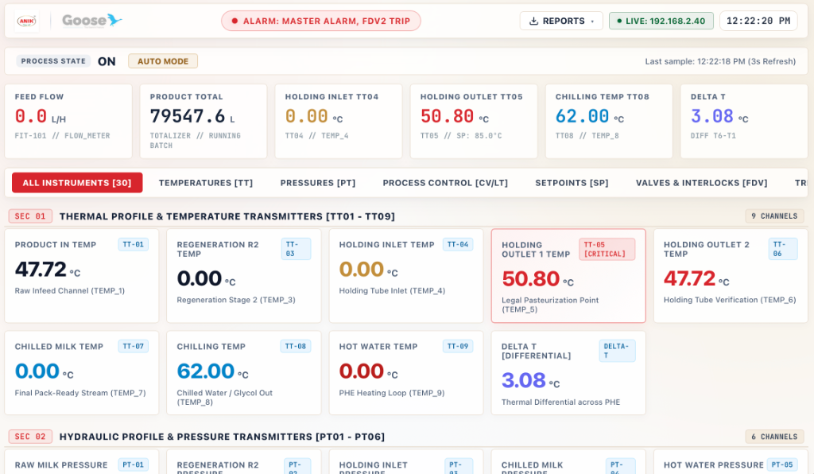
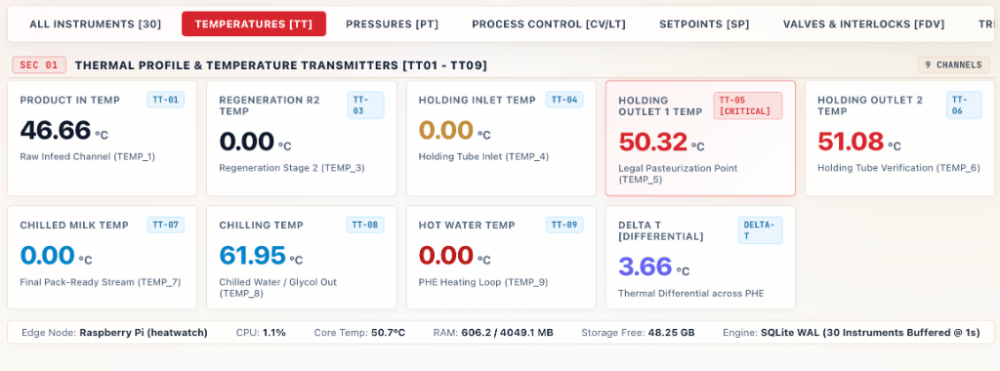
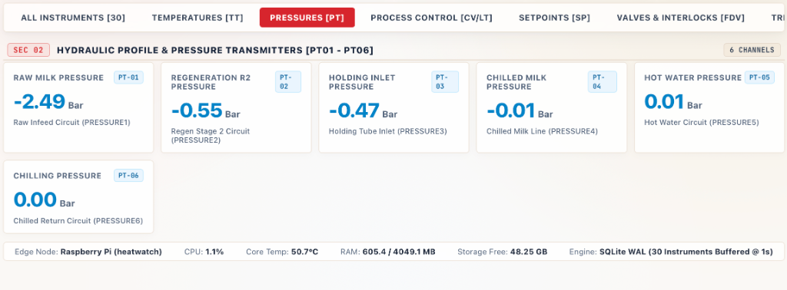
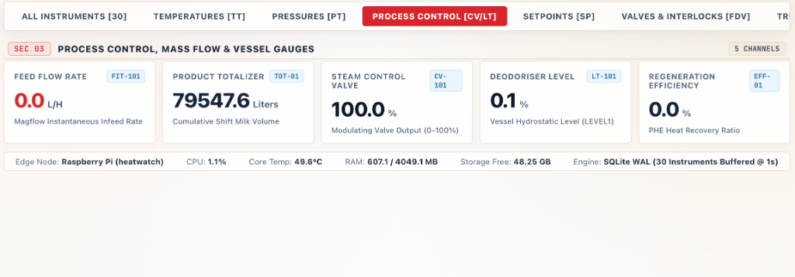
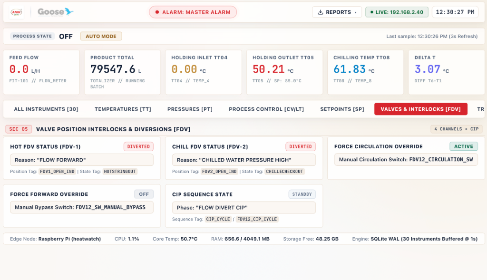
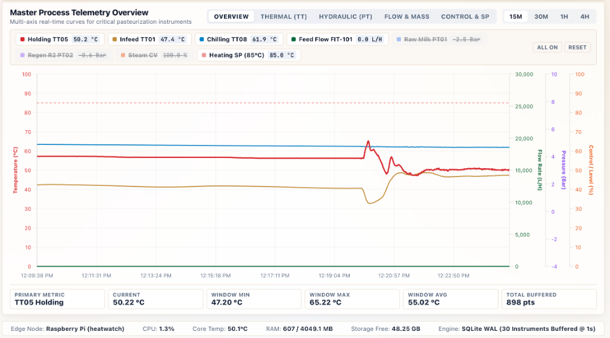
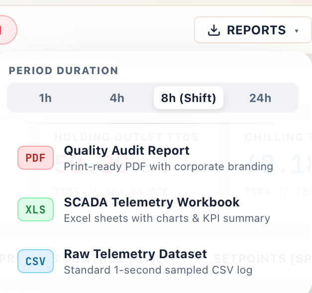

<div align="center">
  
  &nbsp;&nbsp;&nbsp;&nbsp;&nbsp;&nbsp;&nbsp;&nbsp;
  
  <br/><br/>
  <h1>10 KL Pasteurizer Industrial Data Logging System</h1>
  <p><strong>Anik Dairy (Bhopal) & Goose Industrial Automation</strong></p>
  <p><em>Interim Process Telemetry Logger, Live Supervisory Dashboard & Automated SCADA Reporting</em></p>
</div>

---

## Overview

This project provides a complete, lightweight, and resilient data logging solution designed to capture high-frequency (1-second) pasteurizer process telemetry. Built specifically for an interim monitoring phase at Anik Dairy (Bhopal) prior to the commissioning of a permanent cross-contamination prevention system.

### Key Capabilities
- **Modular PLC Abstraction**: Developed in Pune against a physics-faithful `MockPLCClient` that simulates the PHE-3 pasteurizer cycles, temperature dips, and diversion events. Swapping to the physical Allen-Bradley Micro850 PLC at the plant is handled entirely via configuration (`PLC_MODE: live`), without code modifications.
- **SD Card Flash Protection**: High-frequency 1-second sampling (86,400 rows/day) can destroy microSD cards through write amplification. This system utilizes SQLite in **WAL (Write-Ahead Logging)** mode coupled with a thread-safe in-memory ring buffer that commits in atomic batches every 15–30 seconds.
- **Zero-Install Client Dashboard**: Serves a live, responsive SCADA-styled industrial supervisory console over Flask & Chart.js on port `8080` (optimized with 3-second live refresh streaming from `/dev/shm` tmpfs buffer). Any PC or laptop connected to the same network switch can view real-time metrics and trends by navigating to `http://<pi-ip>:8080`.
- **PHE-3 Format Excel Reports**: Generates automated shift and daily `.xlsx` reports matching the column layout and format of the sister-line PHE-3 SCADA report, including high-level KPI summaries and embedded openpyxl trend charts.
- **Systemd Daemons**: Managed as self-healing background system services with automatic restarts, exponential backoff on network dropouts, and rate-limited logging.

---

## Live Supervisory SCADA Dashboard (v3.5.0)

The web supervisory console provides operators and plant engineers with real-time visibility across all 30 pasteurizer instruments, thermal profiles, hydraulic pressures, valves, and multi-axis telemetric trend curves.

### 1. Minimalist Startup & Version Splash Screen (`v3.5.0`)
Clean industrial splash interface showcasing official Anik Dairy and Goose automation branding alongside active firmware/daemon release verification.

<div align="center">
  
</div>

### 2. Supervisory Overview & Master Plant KPIs
Comprehensive supervisory view displaying plant process state (`ON` / `AUTO MODE`), master alarm annunciator bar, real-time clock, shift totalizer (`79,547.6 L`), and critical pasteurization indicators.

<div align="center">
  
</div>

### 3. Thermal Profile & Temperature Transmitters (TT01 – TT16)
Continuous legal pasteurization tracking across the plant's 16 TT channels: Product Inlet (`TT-01`), Regeneration Inlets (`TT-02`, `TT-03`), Holding Tube Inlet (`TT-05`), Legal Pasteurization Point (`TT-06` [CRITICAL]), Holding Verification (`TT-08`), Regeneration Outlet (`TT-11`), Product Outlet (`TT-12`), Chiller Return/Supply (`TT-15`, `TT-16`), Standby Channels (`TT-13`, `TT-14` [NC]), and Differential Delta-T across the PHE.

<div align="center">
  
</div>

### 4. Hydraulic Profile & Pressure Transmitters (PT01 – PT06)
Differential line pressures across raw milk infeed, regeneration stages, holding tube inlet, chilled milk delivery, and hot water loops.

<div align="center">
  
</div>

### 5. Process Control, Mass Flow & Vessel Gauges
Electromagnetic flow meter telemetry (`FIT-101`), cumulative product batch volume totalizer (`TOT-01`), steam modulating control valve position (`CV-101`), and deodoriser vessel hydrostatic level.

<div align="center">
  
</div>

### 6. Valve Position Interlocks, Diversions & CIP Sequence (SEC 05)
Direct monitoring of Flow Diversion Valves (`FDV-1`, `FDV-2`), interlock diagnostic diversion reasons (`FLOW FORWARD`, `CHILLED WATER PRESSURE HIGH`), manual circulation override statuses, and Clean-In-Place (`CIP`) sequence states.

<div align="center">
  
</div>

### 7. Multi-Axis Telemetric Trend Analysis (SEC 06)
Interactive multi-axis time-series visualization with 4 simultaneous Y-axes: **Temperature (°C)**, **Flow Rate (L/H)**, **Pressure (Bar)**, and **Control/Level (%)**. Features instant time window switching (15M, 30M, 1H, 4H), dynamic channel chip toggles, and live min/max/average telemetric statistics strip.

<div align="center">
  
</div>

### 8. One-Click Multi-Format Reporting & Export Modal
Integrated modal for generating audit-grade telemetric exports across selectable durations (`1h`, `4h`, `8h Shift`, `24h`):
- **PDF Quality Audit Report**: Print-ready executive document with corporate branding and KPI tables.
- **XLS SCADA Telemetry Workbook**: Multi-sheet formatted Excel workbook with automated charts.
- **CSV Raw Telemetry Dataset**: Complete 1-second sampled telemetric log.

<div align="center">
  
</div>

---

## Directory Layout

```
├── config/
│   ├── config.yaml          # Master configuration (Mode, IP, intervals, ports, email)
│   └── tags.json            # Mapping of logical names to Micro850 Global Variables
├── src/
│   ├── plc/
│   │   ├── base.py          # BasePLCClient abstract interface
│   │   ├── mock_client.py   # Realistic PHE-3 pasteurizer simulator & fault injector
│   │   ├── live_client.py   # pylogix driver with Micro800=True CIP symbolic reads
│   │   └── __init__.py      # Factory function get_plc_client()
│   ├── storage/
│   │   ├── db.py            # SQLite schema manager & WAL pragmas
│   │   ├── buffer.py        # In-memory batch write-behind buffer
│   │   └── __init__.py
│   ├── dashboard/
│   │   ├── app.py           # Flask server & REST APIs (/api/current, /api/history, /api/system)
│   │   ├── templates/
│   │   │   └── index.html   # Industrial SCADA dark-mode dashboard
│   │   └── static/
│   │       ├── css/style.css# Responsive CSS
│   │       └── js/dashboard.js # Real-time polling & Chart.js renderer
│   ├── reports/
│   │   ├── generator.py     # SCADA-style Excel report builder + openpyxl charts
│   │   ├── scheduler.py     # Shift/daily report trigger + optional SMTP dispatch
│   │   └── __init__.py
│   ├── poller.py            # Main acquisition loop with exponential backoff & signals
│   └── cli.py               # Command-line utility (test-plc, db-stats, generate-report)
├── systemd/
│   ├── pasteurizer-poller.service
│   ├── pasteurizer-dashboard.service
│   ├── pasteurizer-report.service
│   └── pasteurizer-report.timer
├── scripts/
│   ├── setup_pi.sh          # One-click Raspberry Pi installer
│   └── optimize_sd.sh       # SD card longevity tuner (tmpfs & journald)
├── requirements.txt
└── tests/
    └── test_system.py       # Unit and integration test suite
```

---

## Step 1: Raspberry Pi OS Lite Setup (Headless, SSH, Wi-Fi & Pi Connect)

### Flashing with Raspberry Pi Imager
1. Open **Raspberry Pi Imager** on your computer.
2. Select:
   - **Device**: `Raspberry Pi 5`
   - **OS**: `Raspberry Pi OS Lite (64-bit)` (Bookworm)
   - **Storage**: Your microSD card
3. Click **Edit Settings** (or the Gear icon / `Ctrl+Shift+X`):
   - **General Tab**:
     - **Hostname**: `heatwatch` (accessible on LAN as `heatwatch.local` or `192.168.1.169`)
     - **Username**: `elanadu`
     - **Password**: `Elanadu@#$12345`
     - **Wireless LAN**:
       - **SSID**: `Goose-5G`
       - **Wireless LAN country**: `IN`
     - **Timezone**: `Asia/Kolkata`
     - **Keyboard Layout**: `in`
   - **Services Tab**:
     - Check **Enable SSH** (Use password authentication).
4. Click **Save** and **Write**.

---

### First Boot & Remote Access

1. Insert the microSD card into the Raspberry Pi 5 and connect power via official USB-C PD power supply.
2. The Pi will connect to `Goose-5G` or Ethernet.
3. Connect via SSH directly from your terminal:
   ```bash
   ssh elanadu@heatwatch.local
   # OR connect directly via IP:
   ssh elanadu@192.168.1.169
   # Password: Elanadu@#$12345
   ```

---

### Hardware Optimization for MicroSD Card Longevity
Run the included optimization script to configure RAM-based volatile logging and tmpfs:
```bash
cd /home/elanadu/pasteurizer-logger
sudo bash scripts/optimize_sd.sh
```
This script:
- Configures `systemd-journald` to store logs in RAM (`volatile`), preventing constant disk writes.
- Mounts `/tmp` in `tmpfs` (RAM).
- Enables `noatime` on the root filesystem in `/etc/fstab` (disables file access timestamp updates).

---

## Step 2: Python Environment Setup

Clone or copy the project files to the Pi under `/home/elanadu/pasteurizer-logger`:

```bash
cd /home/elanadu/pasteurizer-logger
chmod +x scripts/*.sh

# Run automated installer:
bash scripts/setup_pi.sh
```

Or manually:
```bash
sudo apt-get update && sudo apt-get install -y python3-venv python3-pip sqlite3
python3 -m venv venv
source venv/bin/activate
pip install --upgrade pip
pip install -r requirements.txt
```

---

## Step 3: PLC Client Abstraction & Tag Mapping

### The Abstraction Model
All data access downstream of the PLC layer is completely agnostic to whether the source is the physical Micro850 or the simulator. Both implement `BasePLCClient`:
- `connect() -> bool`
- `disconnect() -> None`
- `is_connected() -> bool`
- `read_tags() -> dict` (always returns clean dictionary with logical keys: `milk_flow`, `holding_in_temp`, `fdv1_status`, etc.)

### Configuring Mode in `config/config.yaml`:
```yaml
plc:
  mode: "mock"           # Use 'mock' in Pune, change to 'live' at Bhopal plant
  ip: "192.168.1.50"     # [PLACEHOLDER] Target Allen Bradley Micro850 IP
  slot: 0
  timeout: 3.0
```

### Mapping Real PLC Tags in `config/tags.json`:
The Allen-Bradley Micro850 requires variables to be declared as **Global Variables** in Connected Components Workbench (CCW). Tag names are **case-sensitive**:

```json
{
  "tags": {
    "milk_flow": {
      "plc_tag": "FIT_101_FlowRate",
      "data_type": "REAL",
      "unit": "L/hr"
    },
    "holding_in_temp": {
      "plc_tag": "TT_101_HoldingInTemp",
      "data_type": "REAL",
      "unit": "°C"
    },
    "holding_out_temp": {
      "plc_tag": "TT_102_HoldingOutTemp",
      "data_type": "REAL",
      "unit": "°C"
    },
    "product": {
      "plc_tag": "Recipe_ProductName",
      "data_type": "STRING"
    },
    "status": {
      "plc_tag": "System_ProcessStatus",
      "data_type": "STRING"
    },
    "fdv1_status": {
      "plc_tag": "FDV1_ForwardStatus",
      "data_type": "BOOL"
    },
    "fdv1_reason": {
      "plc_tag": "FDV1_DiversionReason",
      "data_type": "STRING"
    },
    "fdv2_status": {
      "plc_tag": "FDV2_ForwardStatus",
      "data_type": "BOOL"
    },
    "fdv2_reason": {
      "plc_tag": "FDV2_DiversionReason",
      "data_type": "STRING"
    },
    "cip_status": {
      "plc_tag": "CIP_SystemActive",
      "data_type": "BOOL"
    },
    "cip_step": {
      "plc_tag": "CIP_CurrentStepName",
      "data_type": "STRING"
    },
    "fdv_feedback": {
      "plc_tag": "FDV_AuxFeedbackWord",
      "data_type": "DINT"
    }
  }
}
```

---

## Step 4: Testing & Running the Poller

Test the PLC client and tag read logic directly from the command line:
```bash
./venv/bin/python src/cli.py test-plc
```

Run the poller in the foreground:
```bash
./venv/bin/python src/poller.py
```
Output:
```text
[INFO] (PollerService) Storage initialized with DB: data/pasteurizer_data.db (batch window: 15.0s / max: 30)
[INFO] (PLCFactory) Initializing MOCK PLC Client (PHE-3 SCADA Simulator)
[INFO] (PollerService) Starting Poller Service loop (target interval: 1.00s)
[INFO] (MockPLCClient) MockPLCClient connected (simulating AB Micro850 @ 192.168.1.50)
[DEBUG] (DataBuffer) Flushed 15 telemetry records to SQLite database
```

Check database record counts:
```bash
./venv/bin/python src/cli.py db-stats
```

## Step 5: Live Web Dashboard & Data Exports

Run the Flask dashboard server:
```bash
./venv/bin/python src/dashboard/app.py
```
Open a browser on the client PC (connected to the same switch or Wi-Fi) and navigate to:
`http://192.168.1.169:8080` (or `http://heatwatch.local:8080`)

### Dashboard Features
- **Industrial SCADA Styling**: Premium light theme matching the Anik brand palette with clear high-contrast typography, squared cards, and clean visual hierarchy.
- **Top Brand Separator**: Official Anik Dairy and Goose logos with integrated real-time alarm annunciator and process state pills (`ON` / `AUTO MODE`).
- **3-Second Ultra-Low Latency Streaming**: Fast live updates served straight from `/dev/shm` in-memory tmpfs ring buffer with zero disk I/O drag.
- **38-Instrument Categorized Sections**:
  - **SEC 01 (TT01–TT16)**: Thermal Profile & 16 Temperature Transmitters (with Delta-T calculation; TT13 and TT14 styled as Not Connected).
  - **SEC 02 (PT01–PT06)**: Hydraulic Profile & Pressure Transmitters.
  - **SEC 03 (CV/LT)**: Process Control, Mass Flow (`FIT-101`), Totalizer (`TOT-01`), and Deodoriser Level (`LT-101`).
  - **SEC 04 (SP)**: Legal Pasteurizer and Process Temperature Setpoints.
  - **SEC 05 (FDV/Interlocks)**: Valve actuators and safety interlocks (FDV-1, FDV-2).
- **Multi-Axis Telemetric Trend Analysis**: Interactive multi-axis time-series visualization with 4 simultaneous Y-axes: Temperature (°C), Flow Rate (L/H), Pressure (Bar), and Control/Level (%). Supports 15M, 30M, 1H, and 4H timeframes with interactive channel chips.
- **One-Click Comprehensive Data Exports**: Instant CSV, Excel, and PDF exports featuring complete telemetry across all 38 instruments with shift totals and diagnostic codes.
- **Pi Diagnostics Strip**: Real-time CPU load, SoC temperature, RAM usage, SD card storage, and SQLite WAL buffer metrics.

---

## Step 6: Systemd Service Installation & Autostart

The services ensure that both the poller and the dashboard run unattended, launch automatically on boot, and recover from failures.

Install the service files:
```bash
sudo cp systemd/pasteurizer-poller.service /etc/systemd/system/
sudo cp systemd/pasteurizer-dashboard.service /etc/systemd/system/
sudo cp systemd/pasteurizer-report.service /etc/systemd/system/
sudo cp systemd/pasteurizer-report.timer /etc/systemd/system/

sudo systemctl daemon-reload
sudo systemctl enable pasteurizer-poller.service pasteurizer-dashboard.service pasteurizer-report.timer
sudo systemctl start pasteurizer-poller.service pasteurizer-dashboard.service pasteurizer-report.timer
```

### Managing Services
```bash
# Check status
sudo systemctl status pasteurizer-poller.service
sudo systemctl status pasteurizer-dashboard.service

# View live logs
sudo journalctl -u pasteurizer-poller.service -f
sudo journalctl -u pasteurizer-dashboard.service -f
```

---

## Step 7: Automated SCADA Reports & Exports (Excel, PDF, CSV)

Generate an ad-hoc report on demand via the CLI in your chosen format:
```bash
# Generate Excel report for last 4 hours
./venv/bin/python src/cli.py generate-report --hours 4 --format excel

# Generate PDF report with Anik & Goose logos for last 8 hours
./venv/bin/python src/cli.py generate-report --hours 8 --format pdf

# Generate CSV log for last 24 hours
./venv/bin/python src/cli.py generate-report --hours 24 --format csv
```

   - Active Production Time vs CIP Duration vs Standby Time
   - Average Holding Tube Inlet and Outlet Temperatures during production
   - Number and duration of safety diversion events
   - Embedded openpyxl **LineChart** visualising the thermal profile and flow
2. **Process Telemetry Log Sheet**:
   - Complete 1-sec log matching reference columns (`Date & Time`, `Product`, `Milk Flow`, `Holding In`, `Holding Out`, `FDV-1 Pos`, `FDV-1 Reason`, `FDV-2 Pos`, `FDV-2 Reason`, `Process Status`, `CIP Step`).
   - Clean industrial formatting with zebra rows and auto-fitted columns.

---

## Step 8: Field Commissioning Verification Checklist (Anik Dairy, Bhopal)

When arriving on-site at Anik Dairy to connect to the physical Allen-Bradley Micro850:

```
[ ] 1. PHYSICAL NETWORK CHECK
    - Connect Pi 4B Ethernet port to the plant Ethernet switch (shared with PLC & Client PC).
    - Verify Ethernet link LEDs on both the Pi and the switch are steady green/blinking amber.
    - Check if Pi obtained an IP: 'hostname -I'.

[ ] 2. PLC PING TEST
    - Ping the Allen-Bradley Micro850 IP:
      ping <PLC_IP> -c 4
    - Confirm 0% packet loss and low latency (<2ms).

[ ] 3. VERIFY GLOBAL VARIABLES IN CCW (Connected Components Workbench)
    - With the plant automation engineer, confirm that all target tags are declared as 
      "Global Variables" (not Local/POU-scoped variables).
    - Confirm exact tag spelling and case-sensitivity in 'config/tags.json'.

[ ] 4. TEST READ WITH CLI
    - Update 'config/config.yaml':
      plc:
        mode: "live"
        ip: "<ACTUAL_PLC_IP>"
    - Run the CLI connection test:
      ./venv/bin/python src/cli.py test-plc
    - Verify that all tag names return valid numeric/string values, not None.

[ ] 5. SENSING & SCALING VALIDATION
    - Compare holding tube inlet/outlet temperature readings against the physical 
      gauges/RTD displays on the pasteurizer skid (expect ~81°C during hot pasteurization).
    - Compare milk flow reading with the electromagnetic flowmeter transmitter head.
    - Trigger a test divert (or observe during water circulation): confirm FDV-1 and FDV-2 
      flip from FORWARD (1) to DIVERT (0) on the screen.

[ ] 6. CLIENT PC ACCESS
    - From the plant client's PC browser, open: http://<pi-ip>:8080
    - Verify real-time metric update pulse every second and Chart.js trend progression.

[ ] 7. RESTART SERVICES & MONITOR
    - Restart systemd services to run live:
      sudo systemctl restart pasteurizer-poller.service pasteurizer-dashboard.service
    - Monitor journald for 5 minutes:
      sudo journalctl -u pasteurizer-poller.service -f
    - Confirm no repeated disconnects or unhandled exceptions.
```

---

## Release Notes (v3.5.0)

### Major Additions & Enhancements:
1. **Strict 3-Second Data Logging Cadence**:
   - Poller uses monotonic clocking (`time.monotonic()`) eliminating timing drift across continuous 24/7 logging.
   - Non-blocking `DataBufferWorker` write-behind thread buffers live telemetry in memory and asynchronously flushes batches to SQLite without blocking acquisition cycles.
2. **Complete 16-Channel Temperature Transmitter (TT01 – TT16) Mapping**:
   - `TT-01`: Product Inlet Temperature
   - `TT-02` & `TT-03`: Regeneration 1 & 2 Inlet Temperatures
   - `TT-05`: Holding Tube Inlet Temperature
   - `TT-06`: Legal Pasteurization Point (CCP Critical Control Point with golden highlight)
   - `TT-08`: Holding Outlet Temperature 2
   - `TT-11`: Regeneration 1 Outlet Temperature
   - `TT-12`: Product Outlet Temperature
   - `TT-13` & `TT-14`: Standby / Not Connected channels clearly labeled
   - `TT-15` & `TT-16`: Chiller Inlet & Outlet Temperatures
3. **Full 58-Instrument SCADA Schema Parity**:
   - Standardized `ALL_COLUMNS` schema across CSV exports, Excel workbooks, and automated email attachments.
   - Full parity between on-premise dashboard downloads and automated email dispatches.
4. **Audit-Grade Corporate PDF Quality Reports**:
   - Letter-landscape layout strictly bounded to 10.2 inches ($734.4\text{ pt}$) printable width with zero horizontal clipping.
   - Dual-section SCADA presentation:
     - **Section 1**: Thermal Pasteurization & CCP Audit Log (18 columns with `TT-06 CCP` highlighting)
     - **Section 2**: Plant Hydraulics, Pressures, Energy Setpoints & Auxiliary Log (19 columns)
   - Real-time Pasteurization CCP compliance status, plant efficiency KPIs, and alarms.
5. **Automated Shift-Wise Reporting Engine**:
   - Automatic shift window detection and execution matching plant operations:
     - **1st Shift**: 06:30 AM to 02:00 PM (Generated & dispatched at 14:00:00 IST)
     - **2nd Shift**: 02:00 PM to 10:00 PM (Generated & dispatched at 22:00:00 IST)
     - **3rd Shift**: 10:00 PM to 06:30 AM (Generated & dispatched at 06:30:00 IST)
6. **Consolidated Multi-Attachment Email Dispatch**:
   - Transmits both the **Audit PDF Report** and the **Full 58-Column CSV Telemetry Log** together in a single email.
   - Native support for Zoho Mail SSL on port 465 and standard SMTP STARTTLS on port 587.
7. **Streamlined 58-Column Excel (.xlsx) Export**:
   - Replaced multi-sheet summary layout with a single, high-performance `Telemetry Data` worksheet mirroring CSV data.
   - Freeze panes (`A2`) and native Excel AutoFilter enabled across all 58 columns.
8. **Dashboard Shift Export Selector**:
   - Quick-select buttons for Current Shift, Shift 1, Shift 2, Shift 3, and 24h duration in the export modal.
